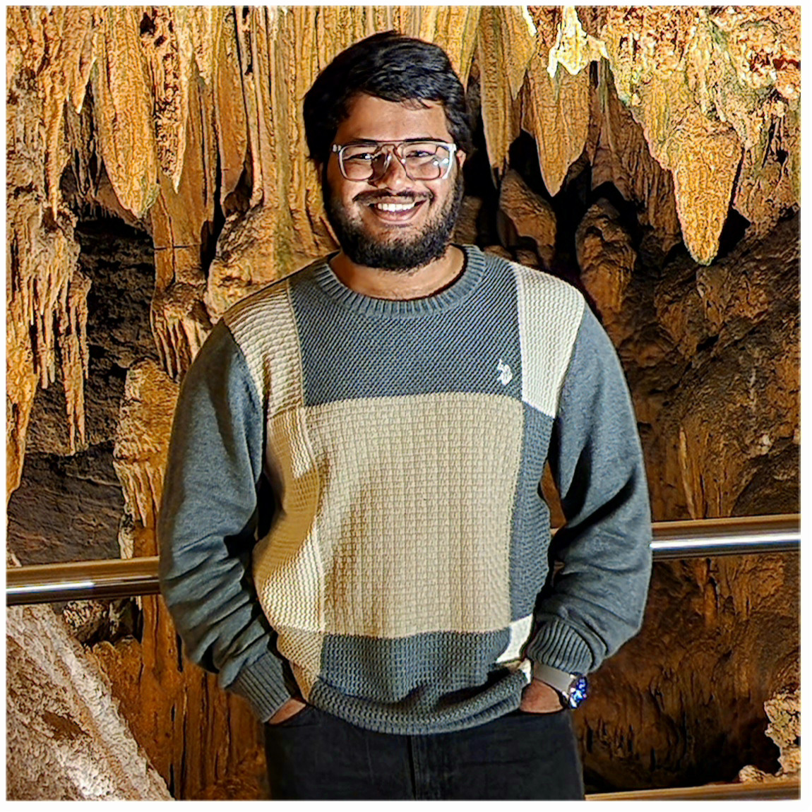

<!-- The (first) h1 will be used as the <title> of the HTML page -->
# Dheerajkumar Reddy Appakondeddigari

<!-- The unordered list immediately after the h1 will be formatted on a single
line. It is intended to be used for contact details -->
- <Gd38211@umbc.edu>
- (443) 527-9807
- Halethrope, MA

<!-- The paragraph after the h1 and ul and before the first h2 is optional. It
is intended to be used for a short summary. -->
As a data science graduate student, my career objective is to leverage my strong foundation in data analysis, machine learning, and statistical modeling to effectively contribute to organizations seeking innovative solutions through data-driven decision-making. I aim to continuously enhance my skills. My goal is to become a valuable asset in the field of data science, driving progress and innovation in data-driven industries.                                                                          

## EDUCATION

<!-- You have to wrap the "left" and "right" half of these headings in spans by
hand -->
### Master’s degree, UMBC AUGUST 2022 -- MAY 2024(expected)
 - 3.34/4  GPA

### Bachelor's degree ,KITS AUGUST 2017 -- MAY 2021
 -7.8/10  CGPA
 
##   EXPERIENCES

### Data Science Student Experiences 

- Designed robust, reusable, and scalable data-driven solutions and data pipeline frameworks to automate the ingestion, processing, and delivery of both structured and 
  unstructured batch and real-time data streaming data using Python Programming.
-	Implemented various components like pipeline, activity, mapping, data flows, data sets, linked services, triggers, and control flow.
-	Performed extensive debugging, data validation, error handling mechanism, transformation types, and data clean-up analysis within large datasets.
-	Worked on version controls like Git 
-	Developed spark applications in PySpark on a distributed environment to load a huge number of CSV files with different schema into Hive ORC tables.
-	Migrated data from hive to MySQL, to be displayed on UI by using PySpark job which runs for different environments.
-	Worked on Tableau to build customized interactive reports, worksheets, and dashboards. 
-	Used GIT to maintain the repository, create and merge branches, commit changes, and check out, move, and remove files.
-	Created data models, stored procedures, and queries for data analysis and manipulations, views, and functions. Maintain, upgrade databases, and create backups in SQL.
-	Involved in developing Spark application using PySpark as per business requirements in the project.

### Environment
- Python, HDFS, Spark, MySQL, Tableau, Git, Aws.

  
## TECHNICAL KNOWLEDGE
- Big Data Eco System	HDFS  `MapReduce`, `Hive`, `Spark`, `Amazon Web Services`.
- Programming Languages	`Python`, `Java`, `SQL (basics)`
- Databases	`MySQL`, `MS SQL SERVER`
- Version control	`GIT`
- Cloud Technologies 	`AWS`, `GCP (learning)`

## PERSONAL INTERESTS  
 -	Data Analysis and Visualization: As a data science student I have a genuine passion for working with data, exploring datasets, and creating meaningful visualizations to communicate insights effectively.
-	Problem Solving: . I enjoy tackling complex problems and finding creative solutions.
-	Ethical Data Use: I promote the ethical use of data and have a desire to address ethical considerations in data science projects.
